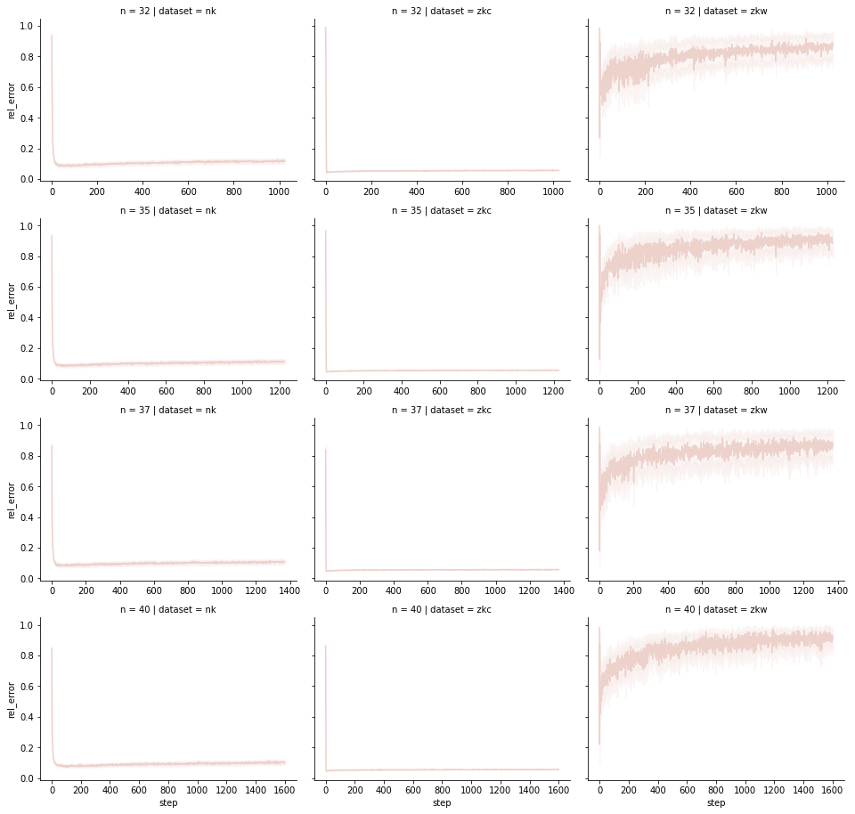
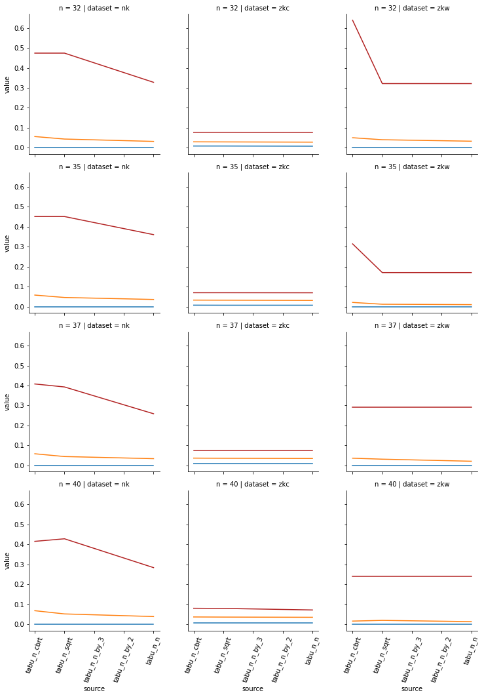
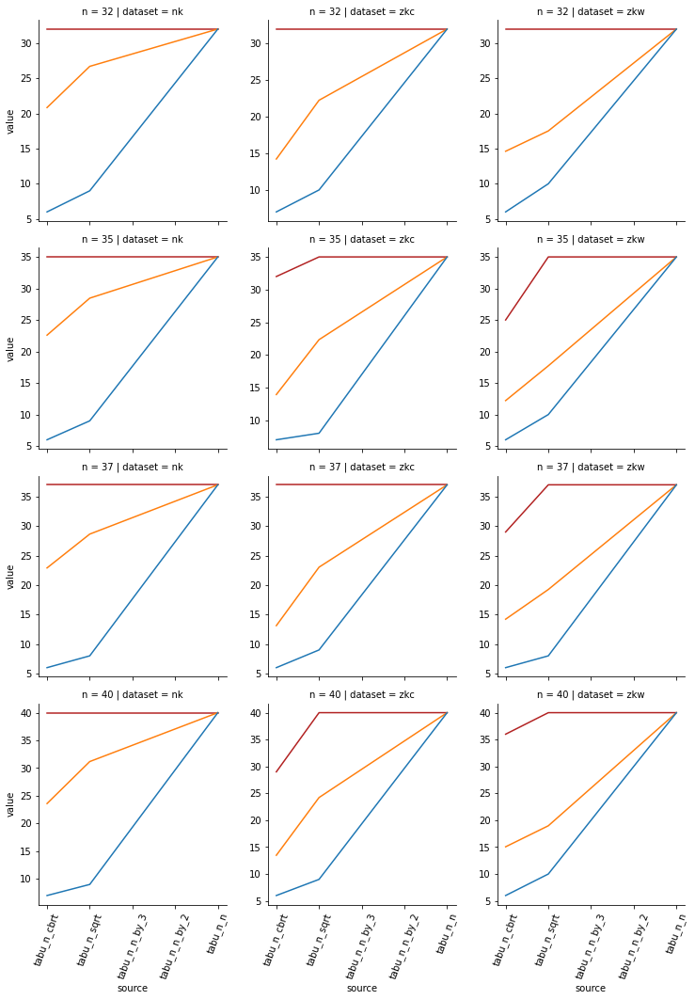
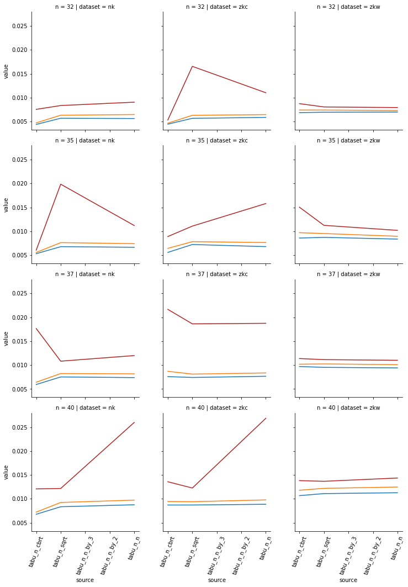

# Tabu Search for Knapsack Problem

`2021, February 4th, Jaroslav Langer`

## Contents

<!-- TOC GFM -->

* [Local Heuristic Choice](#local-heuristic-choice)
* [Tabu Search Description](#tabu-search-description)
* [Experimental Results](#experimental-results)
    * [Solution Progress](#solution-progress)
    * [Impacts of the Tabu Tenure Length](#impacts-of-the-tabu-tenure-length)
        * [Tabu Tenure Impact on Relative Error](#tabu-tenure-impact-on-relative-error)
        * [Tabu Tenure Impact on Number of Visited Configurations](#tabu-tenure-impact-on-number-of-visited-configurations)
        * [Tabu Tenure Impact on Elapsed CPU Time](#tabu-tenure-impact-on-elapsed-cpu-time)
* [Conclusions](#conclusions)

<!-- /TOC -->

## Local Heuristic Choice

After a little effort with searching the comparisons of Simulated annealing, Genetic algorithms and Tabu search I found out the Tabu Search will be interesting to be tried out. To be specific three out of first four internet search results suggest Tabu search to be on the first positions. [[1](https://www.sciencedirect.com/science/article/abs/pii/S0925527306000971), [2](https://journals.sagepub.com/doi/10.1177/0037549716683028), [3](https://www.researchgate.net/publication/275155949_A_Comparative_Study_of_Genetic_Algorithms_Simulated_Annealing_and_Tabu_Search_for_Non-fixed_Destination_Multi-depot_Multiple_Traveling_Salesman_Problem)]. I am aware of the fact that this choice was not very profound, however at least it should not be a huge mistake.

## Tabu Search Description

I believe the easiest way to explain the algorithm is first to show the pseudocode and then comment on the implementation details.

```py
# Python Tabu search pseudocode

state = get_init_state(items)
next = discriminate_and_copy(state)
best = get_empty_state(items)

for step in range(iter_max):
    for swap in range(items):
        state_swap = state.transition(swap)
        if (state_swap.not_tabu()):
            if (state_swap.better(next)):
                next = state_swap
            if (state.better(best)):
                best = state_swap
    state = next
    next = discriminate_and_copy(state)
    tabu.add(state)
return best
```

**Initial state**

The initial state is chosen from Bernoulli distribution, where the probability of 1 (i.e. item is present) follows $p = min \left\{ \frac{capacity}{total\_weight}, 1 \right\}$. The idea behind is very simple, if the weight would be distributed over the items kind of uniformly, then the number of items present in the solution would be roughly correct from the very beginning. In other words initial state of an instance, where the solution consists only one item will most likely not be initialized full of items and vice versa.

**Iterations**

Number of iterations is fixedly set by the input parameter. My favorite option was `max_iter = n` to be specific `max_iter = (lambda x: x)(n)`. The reason is the existence of dynamic programming algorithm for the 0/1 knapsack problem that is $\mathcal{O} (n^2)$. Tabu algorithm checks every neighbor for every step, for `max_iter = n` it is also $\mathcal{O} (n^2)$, so it does not make much sense to have the number of iteration much higher than that, if we could instead use the exact method. This of course does not hold true generally for other problems. In other problems where dynamic programming is not possible the `max_iter` could be reasonably much higher.

Also there could be a termination condition, that would stop the iterations once some criterion would be satisfied e.g. `break` if the best solution was not changed for $k$ last steps.

Another approach would be to use multiple starting points. It would work the same was as the termination condition above, but the iterations would not be stopped for good, only the `state` would be reinitialized (perhaps randomly). I believe this approach can improve the solution pretty much, it will be more discussed later.

**Tabu list and tabu tenure**

The tabu list is implemented as a python dictionary. Value for a given transition says until which step the transition is tabu. The dictionary key for a state is not the whole state (although in this case the binary string representation ending up in hash would maybe work just fine), instead the key describes the transition to the new state. It is done by following tuple:
```py
key_tmp = (         # Create a key describing the transition
        swap_idx,       # Index of the item swapped
        item_prev,      # Previous item value
        value_prev,     # Previous knapsack value
        soln_tmp.value, # Next knapsack value
)
```
This is the key only for the forward transition, every `state.not_tabu()` checks the backward transition as well. The inspiration for tabu list as a dictionary came from this video [Discrete Optimization || 09 LS 9 tabu search](https://www.youtube.com/watch?v=bzEyAmL2JyY). Obviously this implementation is very memory greedy as all the transition stays forever, sometimes their value is updated, but the transition is never deleted. The final size of the `tabu_dict` is then handy for determination of how many states the algorithm visited. Unfortunately this quite destroy the idea of having a short tabu list, so in a real application, the dictionary would need to be either shrank time to time, or some other data structure should be used such list of fixed size possible for a short `tabu_tenure` parameter.

The `tabu_tenure` is fixedly set as by the input parameter. No tabu breaking rule was implemented. If all the transitions are tabu, the `step` is simply incremented until some transition is released. Certainly there is a space for an improvement. The `tabu_tenure` could dynamically change and rules for braking the tabu could potentially improve the performance.

**State evaluation and comparison**

The state is evaluated as the total value of items that it contains. However if the item's weight is greater than the knapsack capacity, the `value` is set to be the difference between the capacity and the `total_weight`. This means, that knapsack that is not overloaded maximizes it's value and overloaded knapsack minimizes it's weight (by maximizing the `value`). Both are heuristics, hopefully their naivety is compensated by the tabu principle. Of course there could be something like "Enable item addition to overloaded knapsack if the value is bigger than the best solution and the capacity is not deviated by more than X" or something. Another simplification is that the next value is simply assigned as `if (solution > next): next = solution`, it means that if there are two transitions with the same value and different weights the one that came first is chosen. Order of item's presence swaps is not randomized i.e. the items with lower index are slightly favored against the ones with greater indices. I believe that for normal instances there are not many items with the same values however it would be interested to test the impact of this comparison against either randomized swap orders or more sophisticated comparison of both value and weight.

## Experimental Results

The results are visualized as a grid of figures, where each column shows different dataset and rows visualize different instance lengths. 

### Solution Progress

Solution progress is visualized as a line chart, where the intensive line is the mean value of all the instances and the lighter band shows the $95\%$ confidence interval of the values (that clearly means there can be values anywhere in the white area, but there can not be much of them).

$max\_iter = n^2,\quad tabu\_tenure = n^2$

At first let's look at the at the $max\_iter = n^2, \quad tabu\_tenure = n^2$ that makes the algorithm $\mathcal{O} (n^3)$ whether the the optimal solution is always reached and how long it usually takes.



Obviously for the `nk` and `zkc` datasets the solutions are found very quickly and there probably are also many similar suboptimal solutions because the solution is not significantly worse with increasing steps even though the $tabu\_tenure = n^2$. On the other hand there is the `zkw` dataset, the best solution (not optimal) is also found very quickly, but as the tabu list requires trying other states the solution quality drastically degrades with increasing steps. There is also pretty visible how the solution values fluctuate, i.e. the state `values` between similar states differ by a lot, which means there are less suitable solutions in comparison to other datasets. Based on this I believe, as I said earlier, the state reinitialization would improve the algorithm's results.

$max\_iter = n,\quad tabu\_tenure = n$

For smaller `max_iter` and `tabu_tenure` everything from previous sections holds true. In addition it is much better visible that for the `zkc` and `zkw` the best state (not necessarily optimal) is usually found in the very few first steps. On the other hand the `nk` dataset converge to the optimal state quite steadily. It means that for dataset with instances like `zkw` better approach would be to change the state more heavily, perhaps multiple random bit-flips every few steps, in contrast the `nk` needs usually many steps to really converge to the best solution.


### Impacts of the Tabu Tenure Length

Impact of the `tabu_tenure` is visualized as a line chart where on the x axis are discrete `tabu_tenure` values ordered from the least increasing function to the most increasing one e.g. $\sqrt[3]{n} < \sqrt{n} < \frac{n}{3} < \frac{n}{2} < n$. There are always three lines in the chart, each one is for a different statistic, **red**, **orange** and **blue** shows the **max**, **mean** and **min** statistic respectively.

#### Tabu Tenure Impact on Relative Error

Findings of the tabu tenure impact on the relative error are in agreement with the solution progress. The more "continuous" are the solutions the more it actually matters to have sufficiently long `tabu_tenure` it is the case of `nk` dataset. On the other hand if the solution space is let's say wild, the longer `tabu_tenure` helps only to some extent and further improvement would need to be done differently.



#### Tabu Tenure Impact on Number of Visited Configurations

This figures shows the importance of larger `tabu_tenure` in order to explore the space as exhaustively as possible. It is most visible on the $tabu\_tenure = \sqrt[3]{n}$, where while the `nk` dataframe visited in average $\frac{2}{3}n$ states, in case of the `zkw` dataframe it is only about about $\frac{n}{2}$. This points to the local minima problem. However as it was shown with the `rel_error` progress, the longer tabu tenure is not necessarily the ultimate key to solve this. Also the number of visited states is infered from the size of the `tabu_dict` that stores the transitions, not states, so the number of visited states can be higher if there are multiple solutions with equal transitions to.



#### Tabu Tenure Impact on Elapsed CPU Time

Unfortunately I think these figures are not very informative. I conclude it from the fact, that there is no obvious trend and the nuances looked differently for every computation I ran. In fact it is not very surprising as the `max_iter` was fixed everytime. The only differences could be in number of nested conditions and number of assignments. For example if the states will come form worse to better and all will be different, there will be more actions than if the solutions would come from best to worse and all were similar i.e. in tabu. In contrast, if there would be some iteration interrupting mechanisms implemented, these figures would may be much more interesting and useful.



## Conclusions

As the relative error were on average under $5\%$ I consider the method to be successful. The main takeaway is that it is possible to explore the states heuristically and do not repeat the states too much. Extreme variant is when the `tabu_tenure == max_iter` (e.g. $max\_iter = n^2,\quad tabu\_tenure = n^2$), where it systematically perform local search that leads to worse and worse results (as the states are chosen from best to worst) until it falls into another local minimum. Even the setting $max\_iter = \mathcal{O} (2^n),\quad tabu\_tenure = \mathcal{O} (2^n)$ does not guarantee to find the optimal solution (as not all states are connected, so it can spend some iterations just by incrementing the `step` variable), however the local search can be considered somewhat exhaustive so if the randomized reinitializations would be applied the chance to find the optimal solution would increase.

Another finding is that for a specific problem there probably will not be one configuration that would be the most efficient to all instances. Even this rather small experiment has shown that. Solution to two different datasets would be improved with techniques leads are one against the other (longer local search vs. more frequent jumps). Having said that, this specificity can be also the method's advantage, i.e. the main corpus is rather simple and the key parts such as "which state is better", or "how exactly the state should be represented inside of the tabu list" can be adjusted relatively easily. It seems that this kind of let's say easy modularity enables the tabu search to be well tailored for the specific data and purpose.

