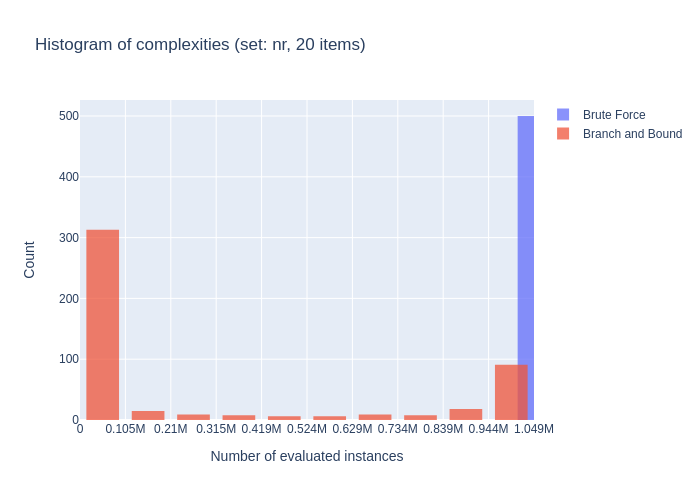
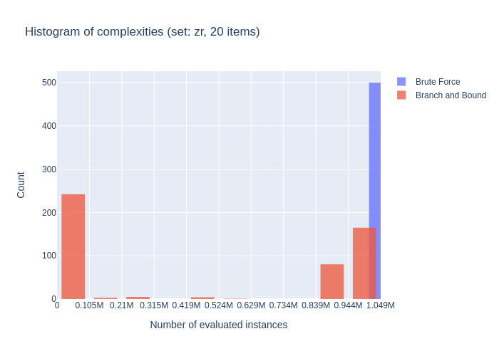
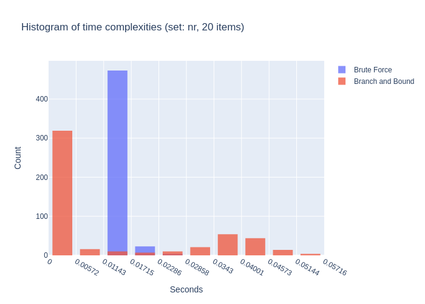
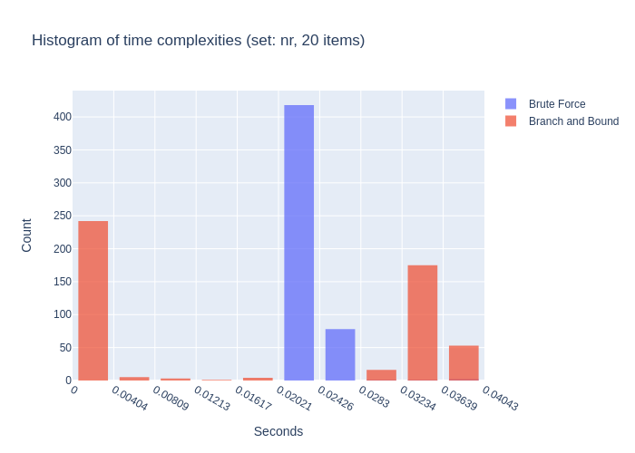
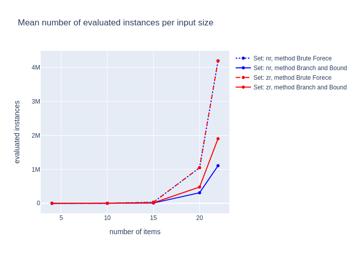
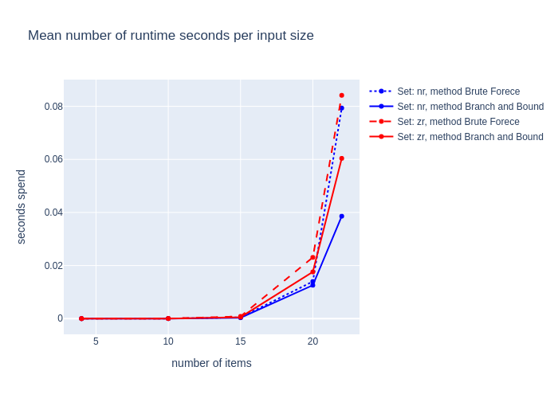

# Exact methods for the knapsack problem <!-- omit in toc -->

2020/10/13

Jaroslav Langer

## Contents <!-- omit in toc -->

- [Decision version of knapsack problem](#decision-version-of-knapsack-problem)
- [Methods](#methods)
  - [Brute Force](#brute-force)
  - [Branch and bound](#branch-and-bound)
    - [Weight based B&B](#weight-based-bb)
    - [Value based B&B](#value-based-bb)
- [Approaches](#approaches)
  - [Brute force implementation](#brute-force-implementation)
  - [Branch and bound implementation](#branch-and-bound-implementation)
- [Results](#results)
  - [Histograms](#histograms)
  - [Mean complexity per input size](#mean-complexity-per-input-size)
- [Conclusions](#conclusions)

## Decision version of knapsack problem

Given a maximum weight capacity ***W***, required total value ***V***, along with a set of *n* items numbered from 1 up to *n*, each with a weight *wi* and a value *vi*. Is there a subset S ⊆ {1, 2, ..., n} such that
$$
\left( \sum_{i \in S} w_i \le W \right)
\land 
\left( \sum_{i \in S} v_i \ge V \right)
$$

Inspired by [FIT/CTU](https://moodle-vyuka.cvut.cz/pluginfile.php/309454/mod_label/intro/KOP%2001%20Kombinatorick%C3%A9%20probl%C3%A9my%20a%20algoritmy.pdf), [Cornell](https://people.orie.cornell.edu/dpw/orie6300/Lectures/lec25.pdf) and [Wikipedia](https://en.wikipedia.org/wiki/Knapsack_problem).

## Methods

There are several ways to to solve this problem. In this homework there are implemented and discussed two of them. 

### Brute Force

This method tries all subset combinations and decides the problem has a solution if at least one subset fits the conditions. Talking complexity of this method, every item can be either included into the subset or not so there are *2n* subsets i.e. the complexity is **O**(*2n*).

### Branch and bound

What differs this method from Brute Force approach is the ability to not evalueate item subsets that can not satisfy the constraints. We can imagine the method as a tree traversal where adding item into the subset means visiting the right child and ommiting it is equal to traverse through the left child. Worst case scenario is still **O**(*2n*), however the everage case makes better.

#### Weight based B&B

Once the total weight of items in the subset is larger than the allowed total weight **W** it does not make any sense to add any other item to the subset i.e. the solution is not in any of the descendents of this node.

#### Value based B&B

In contrast to the weight based B&B, this approach does not consider only what is in the set but also what is still left out. There is a minimal combined value of the subset items, if the total value of the included items sumed up with the value of not visited nodes is smaller than the required total value **V** it does not make any sense to continue exploring the descendentes of this node.

## Approaches

Both methods are implemented as recursive functions in c++ (c) language. Boolean answer of the problem is return. In case the return value is true, the `solution` array is also set to one possible solution of the problem. The complexity is measured by number of called returns. Python script with ctypes library was used for automation of the computation. Library pandas was used for evaluation of the results and the figures were plotted using seaborn library.

### Brute force implementation

The function allways call itself twice, first for including the item into the subset and second for ommiting the item from the subset. Because of the fact that the last call might not be successful (never is for empty subset) the overall return value and the one possible solution (if there is one) must be kept in temporary variables. In terms of complexity, the as the function always call itself twice there is exaclty *2n* calls and returns.

### Branch and bound implementation

Unlike the brute force implementation B&B call itself twice only if the first try was unsuccessful. Also if the the total value of the subset is already big enough it returns true. On the other hand, if the weight is already too big, or the sum of the values to be added plus the subset total value is less then required value **V** false is return without further exploration. Talking about complexity if the required value **V** will be 0, there will be exaclty one return, on the other hand if the all the items will have value 0 there will be exactly *2n* calls and returns.

## Results

### Histograms

### Mean complexity per input size

naměřené výsledky v přehledné formě (nikoliv nepřehledná změť dat)

## Conclusions

Histograms of Brute Force methods shows, that the complexity is input independent. Branch and bound method has much more interesting histograms, as most of the values are distributed at the tails of the value ranges. I assume this is because the fact, that most of the problems either have solution and then it is possible to find it quickly, or the solution does not exist and the weights are not high enough to stop the exploration.

Talking about the complexity dependencies on the input size the results are quite clear. Mr. Evil made the ZR set hard to branch and bound, having said that it is stil better than brute force itself.

