# Experimental Measurements of Algorithms Quality

2020, November 26th

Jaroslav Langer

## Contents <!-- omit in toc -->
- [Algorithms Description](#algorithms-description)
  - [Brute Force](#brute-force)
  - [Branch and Bound](#branch-and-bound)
  - [Dynamic Programming](#dynamic-programming)
  - [Greedy Heuristic](#greedy-heuristic)
  - [REDUX](#redux)
- [Quality and Robustness Measurements](#quality-and-robustness-measurements)
- [Parameters Description and Default Values](#parameters-description-and-default-values)
- [Number of Items](#number-of-items)
  - [Time Complexity](#time-complexity)
  - [Relative Error](#relative-error)
- [Capacity / Total Items Weight](#capacity--total-items-weight)
  - [Time Complexity](#time-complexity-1)
  - [Relative Error](#relative-error-1)
- [Value/Weight Correlation](#valueweight-correlation)
  - [Time Complexity](#time-complexity-2)
  - [Relative Error](#relative-error-2)
- [Weight Distribution](#weight-distribution)
  - [Time Complexity](#time-complexity-3)
  - [Relative Error](#relative-error-3)
- [Granularity](#granularity)
  - [Time Complexity](#time-complexity-4)
  - [Relative Error](#relative-error-4)
- [Items Order Robustness](#items-order-robustness)
  - [Time Complexity](#time-complexity-5)
  - [Relative Error](#relative-error-5)
- [Maximum Item Weight](#maximum-item-weight)
  - [Time Complexity](#time-complexity-6)
  - [Relative Error](#relative-error-6)
- [Maximum Item Value](#maximum-item-value)
  - [Time Complexity](#time-complexity-7)
  - [Relative Error](#relative-error-7)

## Algorithms Description

- Follows description of five methods that were put under analysis.

### Brute Force

- Brute Force method explores every possible combination of filling the knapsack.
- The combinations are tried starting with empty knapsack, adding the items from the last to the first one.
- State is stored as `max_state` every time as it has smaller or equal weight and bigger or equal value than the current `max_state`.

### Branch and Bound

- The Branch and Bound method is similar to the Brute Force method. The difference is, that it does not explore succeeding states once it stopped to make sense.
- Reasons not to explore succeeding states:
  - The current state is heavier than the capacity.
  - The sum of undecided items plus the value of the current state is lesser than the current `max_state`.

### Dynamic Programming

- Dynamic Programming implemented as decomposition by weight.
  - It starts with empty knapsack and empty subset of items to be added.
  - It adds the last item to the `items subset to be added` and finds the best solution for every possible maximum weight from 0 to `max_weight`.
  - It adds items to the `items subset to be added` one by one and every time it finds the best items (best value) for every weight up to `max_weight`.
  - The states are stored in a 2D array, every states stores the information of what was the previous state, so the final items composition is then back traced.
  - One thing that makes this implementation very slow is that for every field of the 2D states vector it creates a choice vector, pushes there the possible states for the field, than finds the max element of the choice vector and copy this element to the 2D states vector (next time i would have implement it very differently). 

### Greedy Heuristic

- Greedy Heuristic sorts all the items in descending order by value/weight ratio.
- Items are added to the knapsack until the next item plus the current items weight is bigger than the capacity.

### REDUX

- The REDUX computes the Greedy Heuristic solution and then it finds the most valuable item that fits into the knapsack.
  - If the one single most valuable item is better solution than the Greedy Heuristic, then it is used instead.
- Finding of the most valuable item is done by copying the items that are not heavier than capacity and then finding the most valuable one in this subset.

## Quality and Robustness Measurements

- The measurements were done for $7$ instance parameters. Each was done separately.
- For every non-categorical value, there were batches of $10$ values.
- In case of categorical parameters all possibilities were explored.
- For every method the relative error and time complexity were measured.
  - The relative error is counted based on the `Brute Force` values that are trusted to be correct.
- There are two main approaches how the results were visualized.
  - Barplot with two bars one in front of the other. Blue bar shows the mean time(/error) and red bar shows the maximum time(/error).
  - Boxplot (classical boxplot) where the mean value is marked as a white circle (for some cases it improves the readability).
- The `bf` and `bab` are not always in the same order in the figures. Sometimes `bf` is first, sometimes `bab` is first. I am sorry for this.

## Parameters Description and Default Values

- Values of the parameters that were not under investigation at the moment.

| Param | Value | Description                                             |
| ---   | ---   | ---                                                     |
| n     | 16    | number of items                                         |
| N     | 100   | number of instances                                     |
| m     | 0.8   | ratio of capacity/total_weight                          |
| W     | 5000  | max weight of an item                                   |
| w     | bal   | preferable weight of an item (light, heavy or balanced) |
| C     | 5000  | max value of an item                                    |
| c     | uni   | weight,value correlation (uni, corr or strong)          |
| k     | 1     | granularity exponent                                    |

## Number of Items

- Parameter number of items ($N$) was tested for values in range of $1$ to $28$.

### Time Complexity

- **Brute Force** and **Branch and Bound**
  - Both mean and worst cases grows exponentially with the number of items.
- **Dynamic programming**
  - Both mean and worst cases grows polynomially with the number of items.
- **Greedy heuristic** and **REDUX**
  - The mean case grows linearly.
  - The worst case of **REDUX** grows less than linearly.

### Relative Error

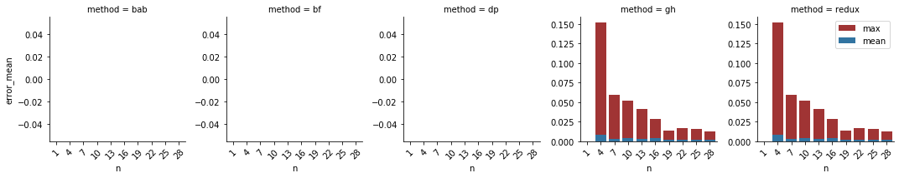

- **Greedy Heuristic** and **REDUX**
  - The relative error decreases significantly (probably exponentially) with increasing number of items.

## Capacity / Total Items Weight

- Parameter `Capacity/Total Items Weight` ($m$) was tested for values in range of $0.1$ to $1$.

### Time Complexity

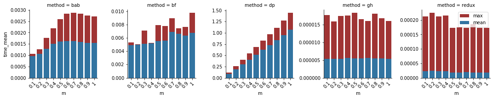

- (`bf` and `bab` have swapped positions, sorry)

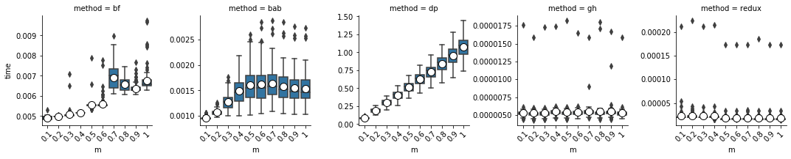

**Brute force** 
- The mean complexity is slowly rising.
  - Probably it is because the fact that heavier states are possible (as the capacity is rising) so more `max_items` are created.

**Branch and bound**
- Complexity steeply rises with growing capacity, peaks at ratio about 0.5 and then slowly declines.
  - This can be explained that with small ratio the capacity is small hence the heavy states are cut away.
  - With big ratios the most of the items could be added so the states with a little items are cut because of small value left.
  - The stability is worse with higher ratio, because the value cut depends on the items order (if the valuable are at the end the performance is worse).

**Dynamic Programming**
- The DP implemented as weight decomposition, so higher ratio means bigger capacity i.e. more iterations.
- The decreasing stability is probably caused by creation of more possible states (that fits into the knapsack).

**Greedy Heuristic** and **REDUX**
- These methods does not show any significant dependencies on the capacity/total_value ratio.
- What they do show is the small stability i.e. the big gap between mean and worst case.
  - This is probably caused by the different performance of integer-float conversions, sorting and copying of different instances.
- The `REDUX` method has a small performance gap between the ratio $0.4$ and $0.5$.
  - However as it is visible on `Number of items in the solution` figure it is not connected to the `REDUX` feature so it must be caused by the copying of the items, or finding the most valuable.

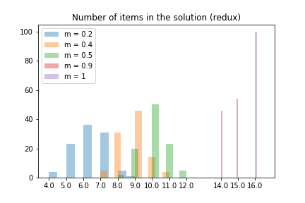

### Relative Error

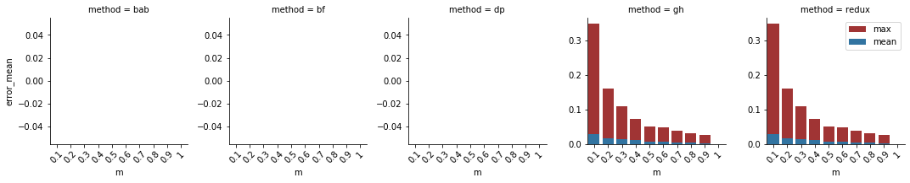

**Greedy Heuristic** and **REDUX**
- Both shows the same trend that the mean relative error is slowly decreasing with increasing ratio
- The worst case of the relative error decrease rapidly with increasing ratio.
  - It is probably because the fact that with increasing capacity more items can fit, so the potential error is lesser.

## Value/Weight Correlation

- Three parameter values were explored. The values and weights were either `uni`formly distributed, `corr`elated or `strong`ly correlated.

### Time Complexity

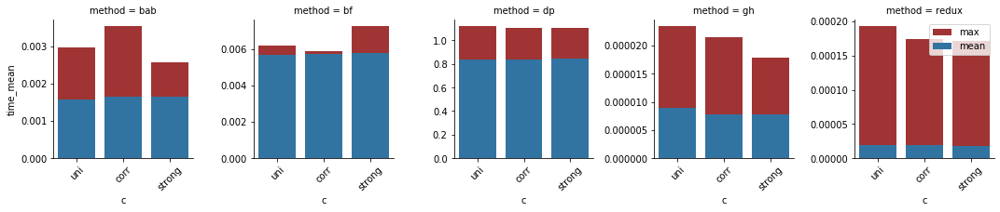

- The only found dependency was in the case of `Greedy Heuristic`, where the uniform distribution of weights and values causes higher complexity than the correlated ones.
  - The poorer performance is however not caused by smaller number of items, because the `strong` parameter provided solution with bigger number of items with lower time complexity.
  - It means the poorer performance must be caused by the sorting part.

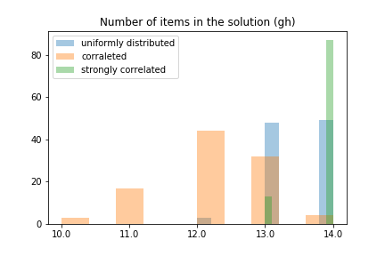

### Relative Error

- Both `Greedy Heuristic` and `REDUX` are show relative error dependency on the value/weight correlation.
  - The algorithms takes first the items with the best ratios, once the weights and values are correlated the ratios start to be similar and the potential space for the error rises.

## Weight Distribution

- The generated items were preferably either `bal`anced, `light` or `heavy`.

**Histogram of weight distributions**
- x axis display weight intervals.

### Time Complexity

- **Brute Force** and **Branch and Bound**
  - The `heavy` parameter value causes poorer performance than the `bal` and `light`.
    - The capacity grows with the weight of the items so it does not affect the weight cuts in `bab` method.
  - The only logical explanation could be that working with bigger numbers is slower than working with smaller ones, but I am not convinced by this without further performance tests.

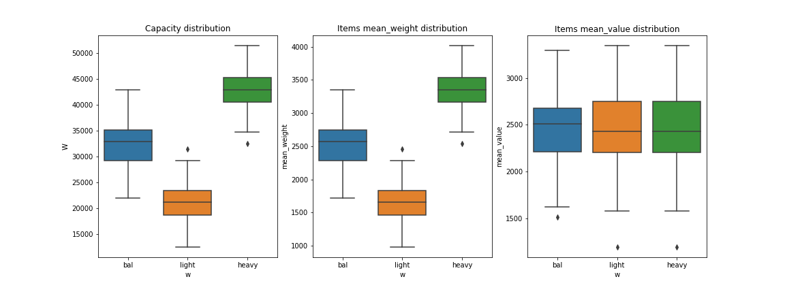

- **Dynamic Programming**
  - The complexity increases with heavier items.
  - Reasonably as the ratio of `capacity/total_weight` is fixed (0.8), if the items are generally lighter the capacity will be smaller and the weight decomposition implementation will be faster.

### Relative Error

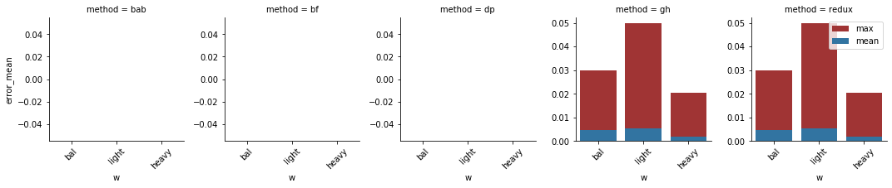

- As was shown on Moodle the light items have better value/weight ratio than the heavy ones, however it does not means the solution will be close to the optimal one.
- The REDUX helps if the best solution is the solution with only one most valuable item, but does not help when the best solution are perhaps two "heavy" items.
- That is why both `Greedy Heuristic` and `REDUX` works best for heavy items and both work worse for light items.

## Granularity

- The weight distribution can be parameterizable more than just to `bal`anced, `light` and `heavy`.
- The $k$ parameter was in range from $0.1$ to $1.0$.
- For the heavy items the probability density function (PDF) is given by formula $f(w)=w^k$.
- The PDF for light items is given by formula  $f(w)=1-w^k$.
- For both heavy and light items the $k=1$ is the most unbalanced and the $k=0.1$ is the most balanced settings.

### Time Complexity

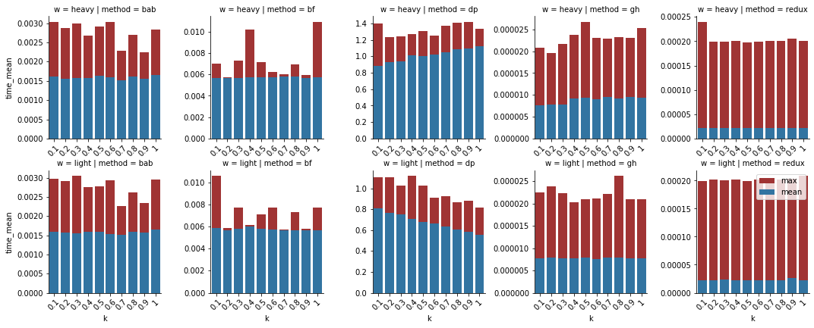

- **Dynamic Programming**
  - The trend from simple weight distribution observations are still valid.
    - The lighter the items are with fixed `capacity/total_value` the smaller capacity gets and the faster weight decomposition will be.
- **Greedy Heuristic**
  - There is a small trend that heavier items cause poorer performance.
  - Because the number of items in the solution is smaller with heavier items (bigger k), this phenomena must be caused by either the sorting of the items (integer to float conversion) or in the writing the Item objects (less likely).

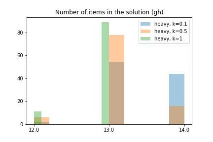

### Relative Error

- The results are not very stable, but it does not show any trend.

## Items Order Robustness

To measure whether the methods are robust to the various order of items, 10 random instances with default parameters were permuted i.e. the items were given in different order.

### Time Complexity

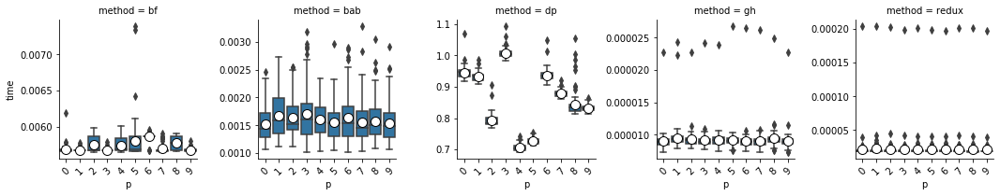

- **Branch and Bound**
  - As we could have expected it, the time complexity depends on the order of the items.
  - If either the heavy or the most valuable items comes first the cutting by either weight or value is used.

### Relative Error

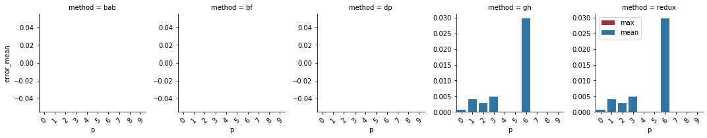

- The order of items does not affect the relative error. This observation is compliant with what we would expect.

## Maximum Item Weight

- The maximum item weight parameter ($W$) was tested with values from range $1000$ to $10000$.

### Time Complexity

- The only visible trend is the growing complexity of `Dynamic Programming` caused by the implementation approach to be the weight decomposition.

### Relative Error

- The different maximum item weights does not affect the relative error of either `Greedy Heuristic` or `REDUX` method.

## Maximum Item Value

- The maximum item value parameter ($C$) was tested with values from range $1000$ to $10000$.

### Time Complexity

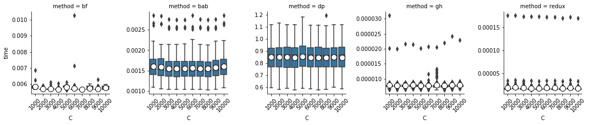

- No significant dependency was discovered here.

### Relative Error

- Relative error of both `Greedy Heuristic` and `REDUX` methods were not dependent on the maximum item value.
