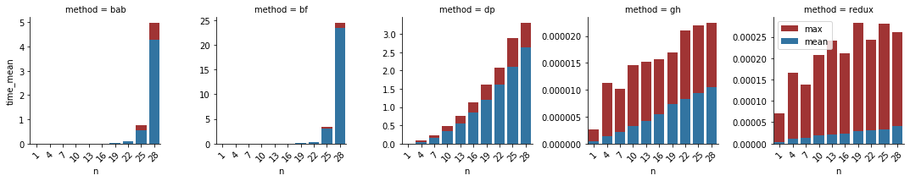
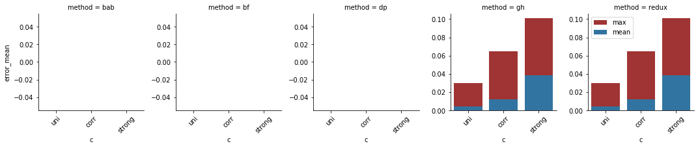
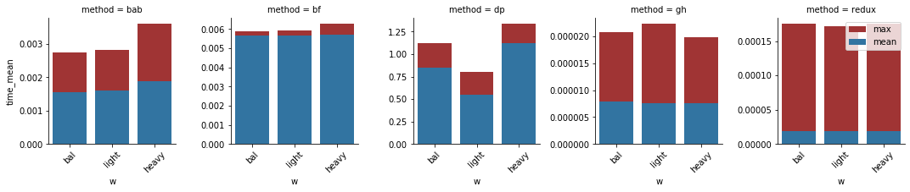
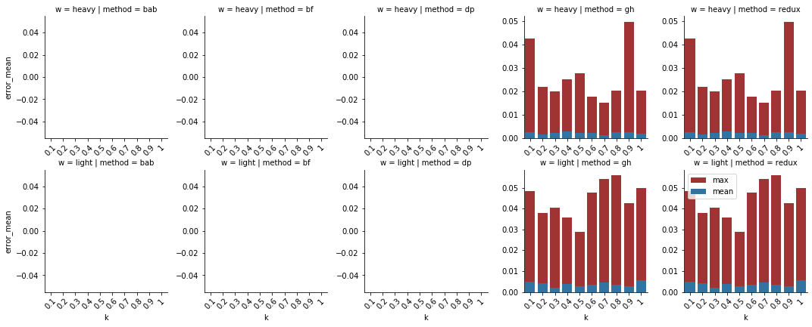
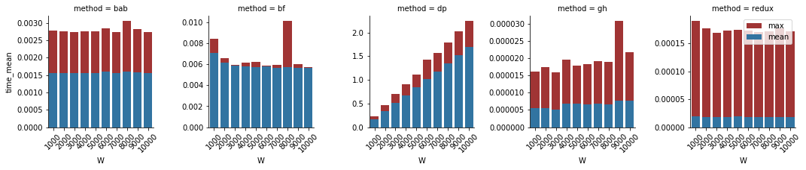
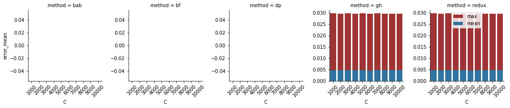

# Experimental Measurements of Algorithms Quality

## Contents <!-- omit in toc -->
- [Algorithms Description](#algorithms-description)
  - [Brute Force](#brute-force)
  - [Branch and Bound](#branch-and-bound)
  - [Dynamic Programming](#dynamic-programming)
  - [Greedy Heuristic](#greedy-heuristic)
  - [REDUX](#redux)
- [Quality and Robustness Measurements](#quality-and-robustness-measurements)
- [Default Parameters](#default-parameters)
- [Number of Items](#number-of-items)
  - [Time Complexity](#time-complexity)
  - [Relative Error](#relative-error)
- [Capacity / Total Items Weight](#capacity--total-items-weight)
  - [Time Complexity](#time-complexity-1)
  - [Relative Error](#relative-error-1)
- [Value/Weight Correlation](#valueweight-correlation)
  - [Time Complexity](#time-complexity-2)
  - [Relative Error](#relative-error-2)
- [Weight Distribution](#weight-distribution)
  - [Time Complexity](#time-complexity-3)
  - [Relative Error](#relative-error-3)
- [Granularity](#granularity)
  - [Time Complexity](#time-complexity-4)
  - [Relative Error](#relative-error-4)
- [Items Order Robustness](#items-order-robustness)
  - [Time Complexity](#time-complexity-5)
  - [Relative Error](#relative-error-5)
- [Maximum Item Weight](#maximum-item-weight)
  - [Time Complexity](#time-complexity-6)
  - [Relative Error](#relative-error-6)
- [Maximum Item Value](#maximum-item-value)
  - [Time Complexity](#time-complexity-7)
  - [Relative Error](#relative-error-7)
- [Additional Figures](#additional-figures)
  - [Capacity / Total Items Weight in Depths](#capacity--total-items-weight-in-depths)
  - [Value/Weight Correlation](#valueweight-correlation-1)
  - [Max Item Weight](#max-item-weight)

## Algorithms Description

- Follows description of five methods that were put under analysis.

### Brute Force

- Brute Force method explores every possible combination of filling the knapsack.
- The combinations are tried starting with empty knapsack, adding the items from the last to the first one.
- State is stored as `max_state` every time as it has smaller or equal weight and bigger or equal value than the current `max_state`.

### Branch and Bound

- The Branch and Bound method is similar to the Brute Force method. The difference is, that it does not explore succeeding states once it stopped to make sense.
- Reasons not to explore succeeding states:
  - The current state is heavier than the capacity.
  - The sum of undecided items plus the value of the current state is lesser than the current `max_state`.

### Dynamic Programming

- Dynamic Programming implemented as decomposition by weight.
  - It starts with empty knapsack and empty subset of items to be added.
  - It adds the last item to the `items subset to be added` and finds the best solution for every possible maximum weight from 0 to `max_weight`.
  - It adds items to the `items subset to be added` one by one and it every time it finds the best items for every weight up to `max_weight`.
  - The states are stored in a 2D array, every states stores the information of what was the previous state, so the final items composition is then back traced.

### Greedy Heuristic

- Greedy Heuristic sorts all the items in descending order by value/weight ratio.
- Items are added to the knapsack until the next item plus the current items weight is bigger than the capacity.

### REDUX

- The REDUX computes the Greedy Heuristic solution and then it finds the most valuable item that fits into the knapsack.
  - If the one single most valuable item is better solution than the Greedy Heuristic, then it is used instead.
- Finding of the most valuable item is done by copying the items that are not heavier than capacity and then finding the most valuable one in this subset.

## Quality and Robustness Measurements

- The measurements were done for 7 instance parameters. Each was done separately. 
- For every non-categorical value, there were batches of 10 values. 
- In case of categorical parameters all possibilities were explored.
- For every method the relative error and time complexity were measured.

## Default Parameters

| Param | Value | Description                                             |
| ---   | ---   | ---                                                     |
| n     | 16    | number of items                                         |
| N     | 100   | number of instances                                     |
| m     | 0.8   | ratio of capacity/total_weight                          |
| W     | 5000  | max weight of an item                                   |
| w     | bal   | preferable weight of an item (light, heavy or balanced) |
| C     | 5000  | max value of an item                                    |
| c     | uni   | weight,value correlation (uni, corr or strong)          |
| k     | 1     | granularity exponent                                    |

## Number of Items

- Parameter number of items `N` was tested in range of 1 to 28.

### Time Complexity

- **Brute Force** and **Branch and Bound**
  - Both mean and worst cases grows exponentially with the number of items.
- **Dynamic programming**
  - Both mean and worst cases grows polynomially with the number of items.
- **Greedy heuristic** and **REDUX**
  - The mean case grows linearly.
  - The worst case of **REDUX** grows less than linearly.

### Relative Error

- **Greedy Heuristic** and **REDUX**
  - The relative error decreases significantly (exponentially?) with increasing number of items.

## Capacity / Total Items Weight

Tested values are from range $0.1$ to $1$.

### Time Complexity

**Brute force** 
- The mean complexity is slowly rising
  - probably it is because the fact that heavier states are possible (capacity is rising) so more `max_items` are created.
- The poor performance of ratio $0.1$ is probably just an [outlier](#capacity--total-value-in-depths).

**Branch and bound**
- Complexity steeply rises with growing capacity, peaks at ratio about 0.5 and then slowly declines.
  - This can be explained that with small ratio the capacity is small hence the heavy states are cut away.
  - With big ratios the most of the items could be added so the states with a little items are cut because of small value left.
  - The robustness is worse with higher ratio, because the value cut depends on the items order (if the valuable are at the end the performance is worse).

**Dynamic Programming**
- The DP implemented as weight decomposition, so higher ratio means bigger capacity i.e. more iterations.
- The decreasing robustness is probably caused by creation of more possible states (that fit into knapsack).

**Greedy Heuristic** and **REDUX**
- These methods does not show any significant dependencies on the capacity/total_value ratio.
- What they do show is the small robustness i.e. the big gap between mean and worst case.
- The poor performance of `gh` ratio 0.9 is probably just an [outlier](#capacity--total-value-in-depths).

### Relative Error

**Greedy Heuristic** and **REDUX**
- Both shows the same trend that the mean relative error is slowly decreasing with increasing ratio
- The worst case relative error decrease rapidly with increasing ratio.
  - It is probably because the fact that with increasing capacity more items can fit, so the potential error is lesser.

## Value/Weight Correlation

- Three parameter values were explored. The values and weights were either uniformly distributed, correlated or strongly correlated.

### Time Complexity

- There was not found a single dependency of the time complexity on the value/weight correlation.
- The most robust method were the `Brute Force` and the `Dynamic programming`, on the other hand the least robust method was the `REDUX`.
  - The poor performance of the `strong` value for `bf` method is probably just an [outlier](#capacity--total-value-in-depths).

### Relative Error

- The dependency of the relative error on the value/weight correlation was not observed.

## Weight Distribution

- The generated items were preferably either balanced, light or heavy.

**Histogram of weight distributions**
- x axis display weight intervals.

### Time Complexity

- The only significant impact of the weight distribution parameter was on the `Dynamic Programming` method. It is implemented as weight decomposition.
- Reasonably the ratio of `capacity/total_weight` is fixed (0.8), if the items are generally lighter the capacity will be smaller and the weight decomposition will be faster.

### Relative Error

- As was shown on Moodle the light items have better value/weight ratio, however it does not needs to be the best solution.
- The REDUX helps if the best solution is the one most valuable item, but does not help when the best solution are perhaps two "heavy" items.
- That is why both `Greedy Heuristic` and `REDUX` works best for heavy items and both work worse for light items.

## Granularity

- The weight distribution can be parameterizable more than just to "balanced", "light" and "heavy".
- The `k` parameter was in range from `0.1` to `1.0`.
- For the heavy items the probability density function (PDF) is given by formula $f(w)=w^k$.
- The PDF for light items is given by formula  $f(w)=1-w^k$.
- For both heavy and light items the $k=1$ is the most unbalanced and the $k=0.1$ is the most balanced settings.

### Time Complexity

- **Dynamic Programming**
  - The trand from simple weight distribution observations holds true.
    - The lighter the items are with fixed `capacity/total_value` the smaller capacity gets and the faster weight decomposition will be.
- **REDUX**
  - There is a small trend that heavier items cause poorer performance.
    - Because it is not true for `Greedy Heuristic` it must be in the value filtering (filter items that are too heavy) and finding the most valuable item.
    - The filtering is done with function `copy_if` that could cause the effect for copying bigger integers.
      - This does not make much sense to me, at least I would not expect the difference to be visible but it is the only explanation I came up with.

### Relative Error

- The results are not very stable, but it does not show any trend.

## Items Order Robustness

To measure the whether the methods are robust with the items given in various ways 10 different instances were permuted.

### Time Complexity

- **Branch and Bound**
  - As we could have expected it, the time complexity depends on the order of the items.
  - If either the heavy or the most valuable items comes first the cutting by either weight or value is used.

### Relative Error

- The order of items does not affect the relative error which is compliant with what we would expect.

## Maximum Item Weight

- The maximum item weight parameter was in range from $1000$ to $10000$.

### Time Complexity

- The only visible trend is the growing complexity of `Dynamic Programming` caused by the implementation approach to be the weight decomposition.

### Relative Error

- The different maximum item weights does not affect either `Greedy Heuristic` or `REDUX` method.

## Maximum Item Value

### Time Complexity

- **Greedy Heuristic**
  - There is a little dent between the 7000 and 8000 maximum value.
  - Because the mean number of items in solution is stable the difference must be either in sorting the items (conversion of the value to float) or in the writing the Items objects (less likely).
- **REDUX**
  - There is a visible leap between 4000 and 5000 maximum value.
  - Because the numbers of items in the solutions are the same (12,13,14). The increase in time can be caused basically only by the operation of finding the biggest element by its value (as it is the only operation, that depends on value).

### Relative Error

## Additional Figures

### Capacity / Total Items Weight in Depths

#### Brute Force

#### Greedy Heuristic

### Value/Weight Correlation

#### Dynamic Programming

### Max Item Weight

#### Greedy Heuristic

#### REDUX

