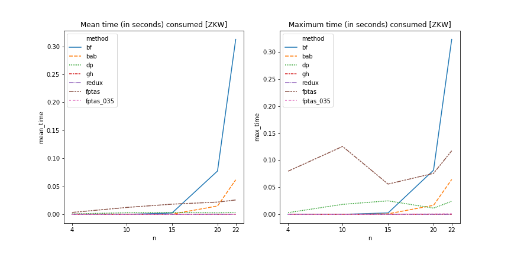
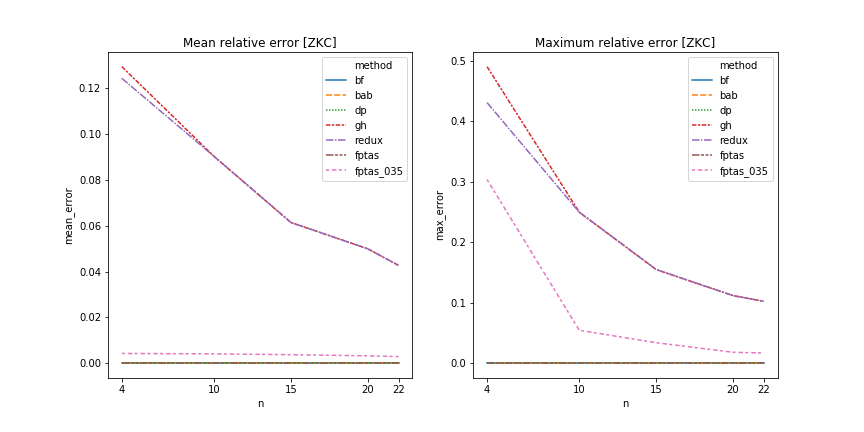

# Exact and Heuristic Approaches for the Constructive Optimization Knapsack Problem

2020/11/12

Jaroslav Langer

## Contents <!-- omit in toc -->

- [Recap of Optimization Knapsack Problem](#recap-of-optimization-knapsack-problem)
- [Description of Approaches](#description-of-approaches)
  - [1) Brute Force](#1-brute-force)
  - [2) Branch and Bound](#2-branch-and-bound)
  - [3) Dynamic Programming](#3-dynamic-programming)
  - [4) Greedy Heuristic](#4-greedy-heuristic)
  - [5) REDUX](#5-redux)
  - [6) FPTAS](#6-fptas)
- [General Information](#general-information)
- [Time Complexity Comparison](#time-complexity-comparison)
  - [NK](#nk)
  - [ZKC](#zkc)
  - [ZKW](#zkw)
- [Relative Error Comparison](#relative-error-comparison)
  - [NK](#nk-1)
  - [ZKC](#zkc-1)
  - [ZKW](#zkw-1)
- [FPTAS Complexity and Error Dependencies on Precision](#fptas-complexity-and-error-dependencies-on-precision)
  - [NK](#nk-2)
  - [ZKC](#zkc-2)
  - [ZKW](#zkw-2)
- [End Notes](#end-notes)

## Recap of Optimization Knapsack Problem

Given a maximum weight capacity ***W*** and set of *n* items numbered from 1 up to *n*, each with a weight *w<sub>i</sub>* and a value *v<sub>i</sub>*. Find subset S ⊆ {1, 2, ..., n} that satisfies
$$
\max\left( \sum_{i \in S} v_i\right)
\land 
\left( \sum_{i \in S} w_i \le W \right) \textrm{.}
$$

## Description of Approaches

### 1) Brute Force

Idea
- Traversal every possible state, find the one with maximum value that satisfies the weight condition.
- The states are explored backwards i.e. first solve emtpy subset, then $S \in \{n\}, S \in \{n-1, n\} ... S \in \{0, 1, ..., n\}$.

Implementation
- The states are implemented as vector of states.
- Traversal is done with for loop.
  - Example: the traversal is left to right top to bottom
```
# Items are added from the last one, X means empty subset
              X
       0               1
   00     10      01       11
000 100 010 110 001 101 011 100
```
- `max_item` is remembered during the last row of the tree (adding/ommiting the item with 0 index).
- The ceritificate (1/0 for every item) is obtained as the binary representation of the `max_item` index in the binary tree array.

### 2) Branch and Bound

Idea
- The main priciple is the same as brute force method.
- Childer of a state are not explored in case:
  - the weight of the state is higher than the max capacity,
  - the sum of `yet_not_explored_items` plus the value of this `state` is lesser than some already found state.

Implementation
- Besides the `vector_of_states`, there is an array of `states_to_be_visited`.
  - `states_to_be_visited` holds the indices to the `vector_of_states`.
- While loop iterates the `states_to_be_visited` until it is not at the end.
- As previously explained if state does not satisfy the branch and bound conditions its children indices are not added to the `states_to_be_visited` array.
- The maximum item and the certificate are obtained the same way as in the brute force method.

### 3) Dynamic Programming

Weight decomposition

Idea
- For certain weight and certain subset of items there can be only one maximal state (`max_state`).
- The algoritm iterates over subsets of items, starts with empty subset and ends with adding the item with index 0.
- In every `max_state` the maximal value camed by:
  - not adding the new item i.e. value is copied form previous `max_state` with the same weight,
  - adding the item to the **previous `max_state` with weight lowered by the item weight**.

Implementation
- Vector of states of size `(number_of_items+1)*(max_weight+1)`.
- Two nested for loops:
  - outer iterates over subsets of items (n -> 0),
    - n means empty subset, so all `max_state`s are set to "0" states,
  - inner iterates over the weights.
- `max_state` remembers its previous `max_weight`.
  - The 1/0 items certificate is obtained by simple comparison `if max_weight == prevous_max_weight` then the item with the index **was not added** (false), otherwise it was added (true).
    - **(This counts on the fact there can not be item with weight 0)**.

### 4) Greedy Heuristic

Idea
- Items are sorted be the value/weight ratio.
- They are added to the knapsack one by one, once the next item does not fit into the knapsack all the other items are not added automatically.

Implementation
- The solution vector (1/0 for every item) is set to false for every one.
- The items remembers its original index.
- Items are sorted by value/weight ratio.
- Every time an item is added, the solution vector with the item's index is set to true.

### 5) REDUX

Idea
- The result of greedy heuristic is compared to the solution of single most valuable item that fits into the knapsack.

Implementation
- Firstly the greedy heruristic is called.
- The items that are not heavier than knapsack kapacity are copied.
- The `most_valuable_item` from filtered items is found.
- `max_value` of the greedy heuristic is compared to the `most_valuable_item`,
  - if the greedy heruristic solution is bigger it is returned,
  - on the other hand `max_value` is set to the value of `most_valuable_item` and the 1/0 certificate is true only for the index of `most_valuable_item`, else false.

### 6) FPTAS

Idea
- Perform the value decomposition. 
  - The `max_possible_value` is calculated as a sum of all the items that **are not heavier than the capacity**.
- For every item subset and certain value there can be only one minimal weight.
- The state with highest value and weight lower than or equal to the capacity is the state with `max_value`,
  - the 1/0 certificate is back traced from it.
- The number of the possible values can be reduced by specifying max_relative_error - `epsilon`
  - `max_possible_value` and item values are divided by denominator `K = (epsilon*max_valued_item) / (n)`
  - `max_valued_item` - is the item with highest value that fits into the kanpsack 

Implementation
- `vector_of_states` of size `(number_of_items+1)*(max_possible_value+1)`
  - The `epsilon` (and `K`) affects the number of iterations, not the size of the `vector_of_states`.
- There are two nested for loops.
  - Outer loop for the subset of items.
    - Starts with empty subset and ends with adding the item with index 0,
  - Inner loop is for the value iteration.
    - If item is not added the `max_state` is copied from the **previous subset with the same value**.
    - If the item is added, than it is added to the **value row** of `previous_item_max_value + this_item_value`.
    - In both cases it is handled that new state does not overide `max_state` with better properties. **States heavier than capacity are not added**.
- The `max_value_item` is found in the `states[0]` i.e. max_state from all the items considered.
- Every state remembers previous value, the solution 1/0 certificate is obtained with `trace_back_solution_by_value` fucntion that compares if the `current_value == previous_value` if so, item was not added (false), when the values differ, the item was added (true).

## General Information

- Fptas without `_number` is plain value decomposition. (~ fptas with epsilon = 0).

## Time Complexity Comparison

- I chose n = 22, to see the leap between the fastest and slowest approach, and also to still be able to see the differences between the others.

### NK

- It is visible, that for the smaller problems, the more advanced methods lose it even though they have lower complexity.
- It is visible that on average the weight decomposition is faster than value decomposition (`dp` vs `fptas`)
- fptas with with max_relative_error 35% looks linearly at this resolution.


### ZKC

- One interesting thing here is the lost of `branch_and_bound` performance (`bab`). It suggests, the ZKC set was designed not to be easily branch and bound by value and weight.


### ZKW

- In this dataset the performace difference between value and weight decomposition is visible even more (`dp` vs `fptas`). It suggests, the values of the items were in higher orders magnitude to the weights.



## Relative Error Comparison

### NK

Mean Relative Error
- The mean relative error of redux method is lesser to the greedy_heuristic approach (`redux` vs `gh`). Mean relative error of both approaches is gradually smaller with the increasing problem size.
- The mean relative error of fptas is gradually bigger with increasing problem size. However the epsilon 0.35 ~ 35% is way above the real results of 0.002 to 0.015 ~ (0.2%-1.5%).

Maximum Relative Error
- The difference between `redux` and `gh` is even bigger in terms of maximum relative error.
- Eventhough the mean relative error of fptas_035 is growing with problem size the maximum relative error does not have clear trend or if it has, then it would be decreasing. The maximum error once reached the set 35% but it never went higher.


### ZKC

- This dataset is somehow nice to aproximative aproaches once the problem size is high enough.



### ZKW

- The gigantic leap between greedy_heuristic and all the other methods suggests, this dataset was desinged to be hard on this method.


## FPTAS Complexity and Error Dependencies on Precision

### NK

#### Time Complexity Comparison

- Following figures shows the significant performance boost if we go along with 95% precision (or less).

![Fptas Time Complexity By Epsilon [NK]](./figures/time_nk_epsilon.png)

#### Relative Error Comparison

- The average cases are always way lower to the set upper bound.
- The maximum relative error discovered some flaw (?).
  - The fptas epsilon 0.05 ~ 5% had maximum relative error up to 15%.
  - It is the same algorithm for all the epsilons.
  - The mean realtive error looks good.
  - In comparison to exact solution, the aproximative are hard to test the correctness (the fptas with epsilon 0 works flawlessly).

![Fptas Relative Errors By Epsilon [NK]](./figures/error_nk_epsilon.png)

### ZKC

#### Time Complexity Comparison

- Nothing to comment here.

![Fptas Time Complexity By Epsilon [ZKC]](./figures/time_zkc_epsilon.png)

#### Relative Error Comparison

- Here is interesting that while for the smaller epsilons, the mean relative error grows with problem size, for the relative error of 35% it decreases with problem size.

![Fptas Relative Errors By Epsilon [ZKC]](./figures/error_zkc_epsilon.png)

### ZKW

#### Time Complexity Comparison

![Fptas Time Complexity By Epsilon [ZKW]](./figures/time_zkw_epsilon.png)

#### Relative Error Comparison

- The same problem of max_relative_error for fptas 0.05

![Fptas Relative Errors By Epsilon [ZKW]](./figures/error_zkw_epsilon.png)

## End Notes

- I tried to implement the fptas with two stacks `curr_states` `next_states`.
  - It did not need to iterate over all the values every time, only over the values that are actually present.
  - For every subset empty to full (items: n -> 0) there was `while(! curr.empty())`.
  - This efficient solution was slower than the brute force method. So I reimplemented it.


